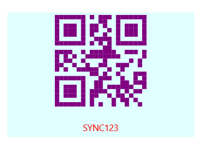

# Getting Started with .NET MAUI Barcode Generator

## Creating an application using the .NET MAUI Barcode Generator

The [.NET MAUI Barcode Generator](https://www.syncfusion.com/maui-controls/maui-barcodes?utm_source=github&utm_medium=listing&utm_campaign=maui-barcode-generator-github-samples) is a data visualization control used to generate and display data in machine-readable format using industry-standard one-dimensional and two-dimensional barcodes. This guide will help you integrate the Barcode Generator control into your .NET MAUI application.

### Step 1: Create a new .NET MAUI application in Visual Studio

1. Go to **File > New > Project** and choose the **.NET MAUI App** template.
2. Name the project and choose a location. Click **Next**.
3. Select the .NET framework version and click **Create**.

### Step 2: Install the Syncfusion .NET MAUI Barcode NuGet package

1. In **Solution Explorer**, right-click the project and choose **Manage NuGet Packages**.
2. Search for Syncfusion.Maui.Barcode and install the latest version.
3. Ensure the necessary dependencies are installed correctly, and the project is restored.

### Step 3: Register the Syncfusion handler

Syncfusion.Maui.Core NuGet is a dependent package for all Syncfusion controls of .NET MAUI. In the MauiProgram.cs file, register the handler for Syncfusion core.

**[C#]**
```
using Microsoft.Maui;
using Microsoft.Maui.Hosting;
using Syncfusion.Maui.Core.Hosting;

namespace BarcodeGettingStarted
{
    public static class MauiProgram
    {
        public static MauiApp CreateMauiApp()
        {
            var builder = MauiApp.CreateBuilder();
            builder
                .UseMauiApp<App>()
                .ConfigureSyncfusionCore()
                .ConfigureFonts(fonts =>
                {
                    fonts.AddFont("OpenSans-Regular.ttf", "OpenSansRegular");
                });

            return builder.Build();
        }
    }
}
```

### Step 4: Add the Barcode Generator namespace

Import the Barcode namespace to your XAML or C# code.

**[XAML]**
```
xmlns:barcode="clr-namespace:Syncfusion.Maui.Barcode;assembly=Syncfusion.Maui.Barcode"
```

**[C#]**
```
using Syncfusion.Maui.Barcode;
```

### Step 5: Initialize the Barcode Generator

Initialize the [SfBarcodeGenerator]() and set a `Value` to display the barcode.

**[XAML]**
```
<ContentPage   
    xmlns="http://schemas.microsoft.com/dotnet/2021/maui"
    xmlns:x="http://schemas.microsoft.com/winfx/2009/xaml"
    xmlns:barcode="clr-namespace:Syncfusion.Maui.Barcode;assembly=Syncfusion.Maui.Barcode"
    x:Class="BarcodeGettingStarted.MainPage">

 <barcode:SfBarcodeGenerator Value="SYNC123"
                           HeightRequest="200"
                           WidthRequest="300"
                           ShowText="True"
                           TextSpacing="25"
                           ForegroundColor="Purple"
                           Background="LightCyan">
        <barcode:SfBarcodeGenerator.TextStyle>
            <barcode:BarcodeTextStyle TextColor="Red"></barcode:BarcodeTextStyle>
        </barcode:SfBarcodeGenerator.TextStyle>
        <barcode:SfBarcodeGenerator.Symbology>
            <barcode:QRCode />
            <!--<barcode:Code39 />-->
            <!--<barcode:DataMatrix />-->
        </barcode:SfBarcodeGenerator.Symbology>
    </barcode:SfBarcodeGenerator>
</ContentPage>
```

**[C#]**
```
using Syncfusion.Maui.Barcode;
. . .

public partial class MainPage : ContentPage
{
    public MainPage()
    {
        this.InitializeComponent();
      using Syncfusion.Maui.Barcode;

    SfBarcodeGenerator barcode = new SfBarcodeGenerator()
    {
        Value = "SYNC123",
        HeightRequest = 200,
        WidthRequest = 300,
        ShowText = true,
        TextSpacing = 25,
        ForegroundColor = Colors.Purple,
        Background = Colors.LightCyan,
        TextStyle = new BarcodeTextStyle 
        { 
            TextColor = Colors.Red 
        },
        Symbology = new QRCode()
    };

    this.Content = barcode;
    }
}
```

